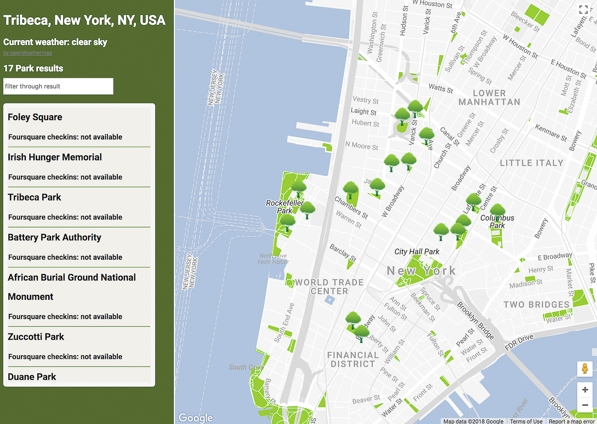

# Park Map 

## Udacity FrontEnd Nanodegree Neighborhood Map
This application shows parks in a specific area. Displayed on a map using Google Map API, it shows the current weather on the location by a third party API, openWeather.org. 
I build the app with HTML, JavaScript, CSS, KnockOut framework and jQuery.

## Run App 
- [Here](https://github.com/NatalieCyreus/parkMap) is the project folder. Download or clone the files. 
- Unzip the folder and run index.html file to open it in a browser. 
## Resources

- [Udacity FrontEnd Nanodegree](https://www.udacity.com/)
- [KnockoutJS](http://knockoutjs.com/)
- [jQuery](https://jquery.com/)
- [Google map API](https://developers.google.com/maps/documentation/javascript/tutorial)
- [Foursquare API](https://developer.foursquare.com/)
- [Openweathermap.org](http://openweathermap.org/)
- [Jshint](http://jshint.com/)